# Fully Custom Question Generation - Workflow Flowchart

## Complete Workflow Diagram

---

## Key Decision Points Flowchart

```mermaid
flowchart TD
    Start([Question Generation Process]) --> LoadCheck{Documents Loaded?}
    
    LoadCheck -->|No| Error1([Error: No Documents])
    LoadCheck -->|Yes| ChunkCheck{Chunks Available?}
    
    ChunkCheck --> Compare{n_chunks vs target}
    
    Compare -->|n_chunks >= target| Strategy1[Strategy: Sample & Use Once<br/>Pick best chunks<br/>1 question per chunk]
    Compare -->|n_chunks < target| Strategy2[Strategy: Cycle Chunks<br/>Repeat chunks<br/>Multiple questions per chunk]
    
    Strategy1 --> Generate[Generate Questions]
    Strategy2 --> Generate
    
    Generate --> CountCheck{Question Count?}
    
    CountCheck -->|< target| Warning[⚠️ Under target<br/>Use all available]
    CountCheck -->|= target| Perfect[✅ Exact count]
    CountCheck -->|> target| Trim[Trim to exact target]
    
    Warning --> Output[Final Output]
    Perfect --> Output
    Trim --> Output
    
    Output --> End([End])
    
    style Start fill:#90EE90
    style End fill:#90EE90
    style Error1 fill:#FFB6C1
    style Strategy1 fill:#87CEEB
    style Strategy2 fill:#FFD700
    style Perfect fill:#90EE90
    style Warning fill:#FFFF99
    style Trim fill:#FFA07A
```

---

## Pydantic Structured Output Flow

---

## Chunk Cycling Logic (Small Documents)

```mermaid
flowchart TD
    Start([Small Document<br/>2 pages, 3 chunks]) --> Target[Target: 20 questions]
    
    Target --> Check{3 chunks < 20 questions?}
    
    Check -->|Yes| Cycle[Cycle Strategy]
    
    Cycle --> Pattern[Cycling Pattern:<br/>0,1,2,0,1,2,0,1,2,0,1,2...]
    
    Pattern --> Positions[20 Positions Created]
    
    Positions --> Breakdown[Chunk Usage:<br/>Chunk 0: Used 7 times<br/>Chunk 1: Used 7 times<br/>Chunk 2: Used 6 times]
    
    Breakdown --> DiffTypes[Different Question Types<br/>Each Position]
    
    DiffTypes --> Example[Example:<br/>Position 0: chatbot_style<br/>Position 3: multi_hop<br/>Position 6: scenario<br/>Same chunk, different questions!]
    
    Example --> Result[✅ Result: 20 questions<br/>from 3 unique chunks]
    
    style Start fill:#87CEEB
    style Cycle fill:#FFD700
    style Pattern fill:#98FB98
    style Result fill:#90EE90
```

---

## Multi-turn Conversation Flow

---

## File Type Processing

---

## Spatial Coverage Strategy

---

## Output Files Structure

---

## How to Use These Diagrams

### **Option 1: Copy to Mermaid Live Editor**
1. Go to https://mermaid.live/
2. Copy any diagram code above
3. Paste and view interactive diagram
4. Export as PNG/SVG

### **Option 2: Use in Markdown**
Just paste the code blocks in any Markdown file that supports Mermaid (GitHub, GitLab, Notion, etc.)

### **Option 3: VS Code**
Install "Markdown Preview Mermaid Support" extension and view in preview

---

## Diagram Legend

| Color | Meaning |
|-------|---------|
| 🟢 Green | Start/End/Success |
| 🔵 Blue | Processing Steps |
| 🟡 Yellow | Decision/Strategy |
| 🟠 Orange | Export/Output |
| 🟣 Purple | Visualization |
| 🔴 Red | Error/Warning |
| 🌸 Pink | Regions/Sections |

---

*All diagrams are in Mermaid format and ready to use!*
